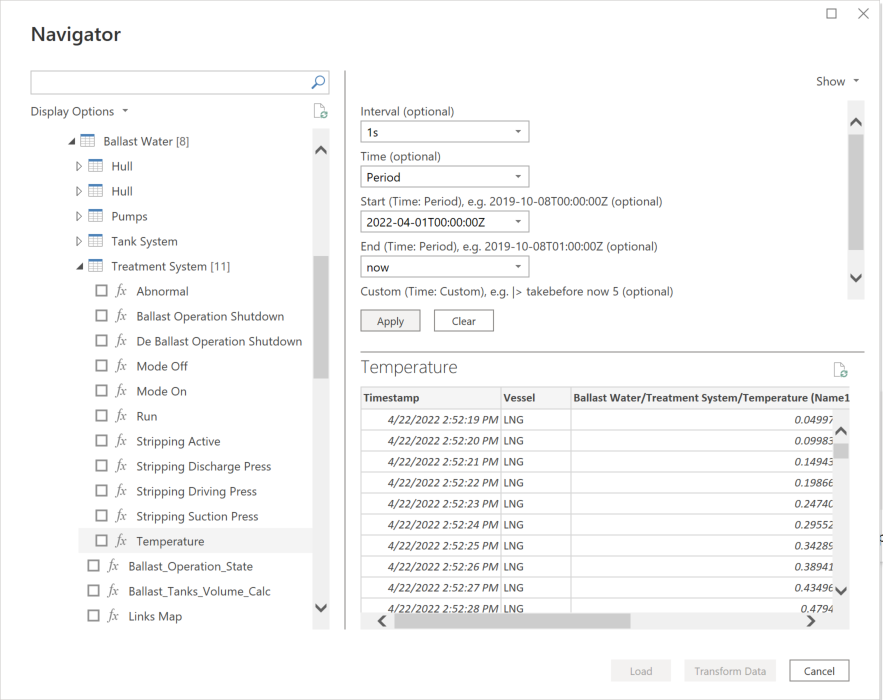
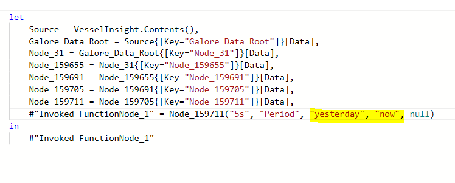
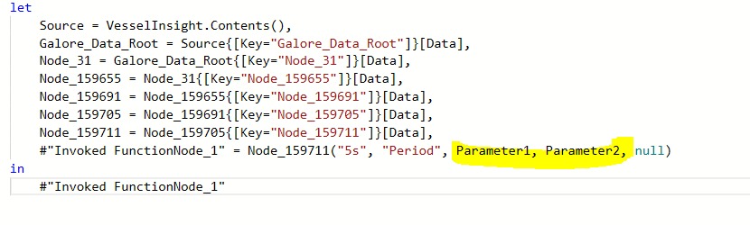
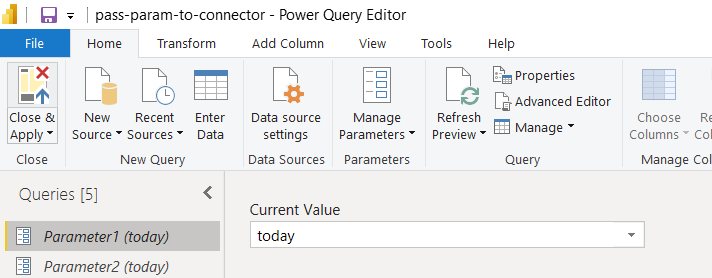

# Vessel Insight
 
## Summary

| Item | Description |
| ---- | ----------- |
| Release State | General Availability |
| Products | Power BI (datasets)
| Authentication Types Supported | Organizational account |
|

## Prerequisites
Before you can sign in to Vessel Insight, you must have an organization account (username/password) connected to a tenant.

 
## Capabilities Supported
* Import
* Advanced option with TQL

## Connect to Vessel Insight

To connect to Vessel Insight:

1. Select **Get Data** from the **Home** ribbon in Power BI Desktop. Select **Other** from the categories on the left, select **VesselInsight**, and then select **Connect**.

   

2. If this is the first time you're getting data through the Adobe Analytics connector, a third-party notice will be displayed. Select **Don't warn me again with this connector** if you don't want this message to be displayed again, and then select **Continue**.

3. To sign in to your Vessel Insight account, select **Sign in**.

   

4. In the window that appears, provide your Vessel Insight tenant URL in the format "[companyname].kognif.ai". Click **Validate**

    

5. In the window that appears, provide your credentials to sign in to your Vessel Insight account. 

   

   If you entered an email address and password, select **Continue**.

6. Once you've successfully signed in, select **Save**.

   

Once the connection is established, you can preview and select data within the **Navigator** dialog box to create a single tabular output. 


Here you have the options to select:
* **Advanced** - write custom TQL queries. See [TQL query example](#tql-query-example)
* **Vessel Insight Data (deprecated)** - time series data for your fleets in old asset hierarchy
* **Vessel Insight Data 2.0** - time series data for your fleets in new asset hierarchy. Only tags with data will be shown
* **Voyage** - voyage data

You can also provide any optional input parameters required for the selected items. For more information about these parameters, see [Optional input parameters](#optional-input-parameters). I you don't input parameters, you will get the latest value.

You can **Load** the selected time series data, which brings the one table for each selected time series tag into Power BI Desktop, or you can select **Transform Data** to edit the query, which opens Power Query Editor. You can then filter and refine the set of data you want to use, and then load that refined set of data into Power BI Desktop. 


## Optional input parameters

When you've selected the Vessel Insight data you want to load or transform in the Power Query **Navigator** dialog box, you can also limit the amount of data by selecting a set of optional input parameters. 



These input parameters are:

* **Interval** (optional) - how you want the data to be aggregated when displayed (1s, 5s, >=30s, 1m, 1h, 1d )
* **Time** (optional) - set time filter type of you want to filter on time. 
  * Latest: Get latest value only. Will return 1 value
  * Period: Filter on time range. Requires setting Start and End date below 
  * Custom: custom query to filter on number of values to return
* **Start** (Time:Period), e.g. 2019-10-08T00:00:00Z (optional) - filter on range by inserting start date and time here. Possible to set "yesterday" and "today". Requires setting Time: Period.
* **End** (Time:Period), e.g. 2019-10-08T01:00:00Z (optional) -  filter on range by inserting end date and time here. Possible to set "today" and "now". Requires setting Time: Period. 
* **Custom** (Time: Custom), e.g. |> takebefore now 5 (optional) - add custom query to filter on number of values. "|> takebefore now 5" means take 5 values before the time now. Requires Time: Custom

If you are importing multiple tags, it can be cumbersome to input the parameters manually for each tag. In this case, we recommend to use **Power Query parameters** for Start and End date in the Power Query Editor: [Power Query parameters](https://docs.microsoft.com/en-us/power-query/power-query-query-parameters)

In **Advanced Editor**, do the following updates for all the tables:

Change the #"Invoked FunctionNode_1" and replace the 3rd (Start parameter) and 4th (End parameter) variable to the new Power Query parameters.





After replacing the variables in Advanced editor, click **Parameter1** and **Parameter2** to change the values for Start and End date. This will affect the date range  filtering when refreshing the data.



## TQL query example
For advanced users, TQL queries can be used to transform and filter data when importing into Power BI. Below is an example to combine multiple tags into one table using TQL.

```TQL
let​
    Source = VesselInsight.Contents(),​
    advanced_node_root = Source{[Key="advanced_node_root"]}[Data],​
    custom_tql_query = advanced_node_root{[Key="custom_tql_query"]}[Data],​
    generateTQL = (start,end) =>​
        let ​
            start=DateTime.ToText(startDateTime,"yyyy-MM-ddThh:mm:ssZ"),​
            end=DateTime.ToText(endDateTime,"yyyy-MM-ddThh:mm:ssZ"),​

            tql = Text.Combine({​
            "[input ~/Fleet/<IMO number>/Aux_Engines/1/Fuel_Flow;", ​
            "input ~/Fleet/<IMO number>/Aux_Engines/1/Generator_Power;",​
            "input ~/Fleet/<IMO number>/Aux_Engines/2/Generator_Power;",​         
            "|> combine |> takefrom ", start,"|>taketo",end," |> aggregate 1m",​
            "|> map 'v[0]' 'v[3]' 'v[6]' 'v[9]'  "             ​
               })​
        in​
            tql,​

    kpis = Table.AddColumn( Source, "KPIS", each  custom_tql_query(generateTQL(startDateTime, endDateTime))),​
    Galore_Data_Root = kpis{[Key="Galore_Data_Root"]}[KPIS],​

    #"Removed Columns" = Table.RemoveColumns(#"Galore_Data_Root",{"Full Path"}),​
    ColumnNames = Table.ColumnNames(#"Removed Columns"),​
    #"Renamed Columns" = Table.RenameColumns( #"Removed Columns",{​
    {ColumnNames{1}, "Vessel name"},​
    {ColumnNames{2}, "AE Fuel Flow"},​
    {ColumnNames{3}, "AE1 Power"},​
    {ColumnNames{4}, "AE2 Power"}})​
in​
    #"Renamed Columns" ​
```

Explanation of the query:

* **Start** and **End** represents the Start and End input parameters.
    ```TQL
    let​
    Source = VesselInsight.Contents(),​
    advanced_node_root = Source{[Key="advanced_node_root"]}[Data],​
    custom_tql_query = advanced_node_root{[Key="custom_tql_query"]}[Data],​
    generateTQL = (start,end) =>​
        let ​
            start=DateTime.ToText(startDateTime,"yyyy-MM-ddThh:mm:ssZ"),​
            end=DateTime.ToText(endDateTime,"yyyy-MM-ddThh:mm:ssZ"),​
    ```

* Add the **path** for each tag that you want to combine in this format:
~/Fleet/IMO number/System/Sub-system/Component

    ```TQL
    tql = Text.Combine({​
            "[input ~/Fleet/<IMO number>/Aux_Engines/1/Fuel_Flow;", ​
            "input ~/Fleet/<IMO number>/Aux_Engines/1/Generator_Power;",​
            "input ~/Fleet/<IMO number>/Aux_Engines/2/Generator_Power;",​         
            "|> combine |> takefrom ", start,"|>taketo",end," |> aggregate 1m",​
    ```

* For each tag, by default, these columns are returned in this order: max, min, avg and count. If you only want avg, you need to **specify the column** (vector), n+3 element for each tag (every 3 element).
    ```
     "|> map 'v[0]' 'v[3]' 'v[6]' 'v[9]'  "             ​
               })​
    in​
        tql,​
    ```

* **Rename** the columns
    ```TQL
      ColumnNames = Table.ColumnNames(#"Removed Columns"),​
        #"Renamed Columns" = Table.RenameColumns( #"Removed Columns",{​
        {ColumnNames{1}, "Vessel name"},​
        {ColumnNames{2}, "AE Fuel Flow"},​
        {ColumnNames{3}, "AE1 Power"},​
        {ColumnNames{4}, "AE2 Power"}})​
    in​
        #"Renamed Columns" ​
```

## Limitations and issues

You should be aware of the following limitations and issues associated with accessing Vessel Insight data.

* There is a general limit of 1GB data that is imported into Power BI, unless the workspace is in a Power BI Premium capacity. It is recommended to aggregate and choose short date range when importing time series data as it can become heavy.

* Each time series tag with associated values will be outputted in a separate table in Power BI. If it is necessary to combine tags and values into one single table, they need to be merged in Power Query Editor or with TQL queries.

* The time series data is currently stored in Couchbase which might have weaknesses that impacts the Power BI connector. 

* The API request timeout is by default 1 minute.

For additional guidelines on accessing Vessel Insight data, see [The Getting started guide](https://view.officeapps.live.com/op/view.aspx?src=https%3A%2F%2Fwww.kongsberg.com%2Fglobalassets%2Fdigital%2Fsolutions%2Fvessel-insight%2Fpowerbi-gsx.pptx&wdOrigin=BROWSELINK).

## Next steps

You may also find the following Vessel Insight information useful:

* [About Vessel Insight Power BI connector](https://www.kongsberg.com/digital/solutions/vessel-insight/vessel-insight-power-bi-connector/)
* [About Vessel Insight](https://www.kongsberg.com/digital/solutions/vessel-insight/)
* [Vessel Insight API](https://developer.kognif.ai/)